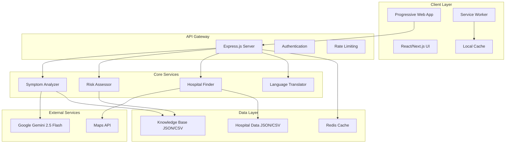

# Design Document: VetConnect AI

## Overview

VetConnect AI is a Progressive Web Application (PWA) that provides AI-powered livestock health assessment for rural farmers in India. The system combines multimodal AI analysis (text and image processing) with a comprehensive knowledge base to deliver risk assessments, treatment recommendations, and connections to veterinary care facilities.

The application follows a mobile-first design approach with offline capabilities, multi-language support, and a low-literacy friendly interface optimized for rural users with varying levels of digital literacy.

## Architecture

### High-Level Architecture



### Technology Stack

**Frontend:**
- React 18 with Next.js 14 for server-side rendering and PWA capabilities
- Tailwind CSS for responsive, mobile-first styling
- React Hook Form for form management
- React Query for API state management and caching

**Backend:**
- Node.js with Express.js framework
- Multer for file upload handling
- Helmet for security headers
- CORS for cross-origin resource sharing
- Winston for logging

**AI and External Services:**
- Google Gemini 2.5 Flash Vision API for multimodal analysis
- Google Translate API for language support
- OpenStreetMap/Google Maps for location services

**Data Storage:**
- JSON files for knowledge base (diseases, symptoms, treatments)
- CSV files for hospital directory
- Redis for session caching and rate limiting

## Components and Interfaces

### Frontend Components

#### AnimalSelector Component
```typescript
interface AnimalSelectorProps {
  onAnimalSelect: (animal: AnimalType) => void;
  selectedLanguage: Language;
}

type AnimalType = 'cow' | 'goat' | 'buffalo';
type Language = 'en' | 'ta';
```

Renders animal selection interface with large, visual icons. Supports keyboard navigation and screen readers.

#### SymptomInput Component
```typescript
interface SymptomInputProps {
  animalType: AnimalType;
  onSubmit: (data: SymptomData) => void;
  isLoading: boolean;
}

interface SymptomData {
  textDescription?: string;
  imageFile?: File;
  urgencyLevel?: 'low' | 'medium' | 'high';
}
```

Dual-mode input component supporting both photo upload and text description. Includes image preview, compression, and validation.

#### DiagnosisDisplay Component
```typescript
interface DiagnosisDisplayProps {
  diagnosis: DiagnosisResult;
  language: Language;
  onRequestHelp: () => void;
}

interface DiagnosisResult {
  conditions: Condition[];
  riskLevel: 'low' | 'medium' | 'high';
  confidence: number;
  recommendations: Recommendation[];
  emergencyFlag: boolean;
}
```

Displays AI analysis results with risk-appropriate styling and clear action items.

#### HospitalFinder Component
```typescript
interface HospitalFinderProps {
  userLocation?: GeolocationCoordinates;
  riskLevel: 'low' | 'medium' | 'high';
  language: Language;
}

interface Hospital {
  id: string;
  name: string;
  address: string;
  phone: string;
  distance: number;
  operatingHours: string;
  services: string[];
}
```

Location-aware hospital directory with distance calculation and contact information.

### Backend Services

#### SymptomAnalyzer Service
```typescript
class SymptomAnalyzer {
  async analyzeSymptoms(
    animalType: AnimalType,
    symptoms: SymptomData
  ): Promise<AnalysisResult> {
    // Processes multimodal input through Gemini API
    // Cross-references with knowledge base
    // Returns structured analysis
  }
}

interface AnalysisResult {
  conditions: PossibleCondition[];
  confidence: number;
  processingTime: number;
  rawGeminiResponse: string;
}
```

#### RiskAssessor Service
```typescript
class RiskAssessor {
  assessRisk(
    conditions: PossibleCondition[],
    animalType: AnimalType
  ): RiskAssessment {
    // Evaluates condition severity
    // Considers animal-specific factors
    // Returns risk level and recommendations
  }
}

interface RiskAssessment {
  level: 'low' | 'medium' | 'high';
  factors: string[];
  recommendations: ActionRecommendation[];
  timeframe: string;
}
```

#### HospitalFinder Service
```typescript
class HospitalFinder {
  async findNearestHospitals(
    location: GeolocationCoordinates,
    maxDistance: number = 50
  ): Promise<Hospital[]> {
    // Calculates distances to government facilities
    // Filters by operating status
    // Returns sorted by distance
  }
}
```

### API Endpoints

#### POST /api/analyze
```typescript
interface AnalyzeRequest {
  animalType: AnimalType;
  textSymptoms?: string;
  imageBase64?: string;
  language: Language;
}

interface AnalyzeResponse {
  diagnosis: DiagnosisResult;
  hospitals?: Hospital[];
  sessionId: string;
}
```

#### GET /api/hospitals
```typescript
interface HospitalRequest {
  lat: number;
  lng: number;
  radius?: number;
}

interface HospitalResponse {
  hospitals: Hospital[];
  totalCount: number;
}
```

#### POST /api/translate
```typescript
interface TranslateRequest {
  text: string;
  targetLanguage: Language;
}

interface TranslateResponse {
  translatedText: string;
  sourceLanguage: string;
}
```

## Data Models

### Knowledge Base Schema

#### Disease Model
```typescript
interface Disease {
  id: string;
  name: {
    en: string;
    ta: string;
  };
  animalTypes: AnimalType[];
  symptoms: Symptom[];
  severity: 'low' | 'medium' | 'high';
  treatments: Treatment[];
  prevention: string[];
  veterinaryRequired: boolean;
}
```

#### Symptom Model
```typescript
interface Symptom {
  id: string;
  description: {
    en: string;
    ta: string;
  };
  visualIndicators: string[];
  severity: number; // 1-10 scale
  commonWith: string[]; // Related symptom IDs
}
```

#### Treatment Model
```typescript
interface Treatment {
  id: string;
  type: 'home_care' | 'veterinary' | 'emergency';
  instructions: {
    en: string[];
    ta: string[];
  };
  duration: string;
  warnings: string[];
  followUpRequired: boolean;
}
```

### Hospital Data Schema

#### Hospital Model
```typescript
interface Hospital {
  id: string;
  name: {
    en: string;
    ta: string;
  };
  type: 'government' | 'private';
  address: {
    street: string;
    city: string;
    district: string;
    state: string;
    pincode: string;
  };
  coordinates: {
    lat: number;
    lng: number;
  };
  contact: {
    phone: string[];
    email?: string;
  };
  services: string[];
  operatingHours: {
    [key: string]: string; // day: hours
  };
  emergencyAvailable: boolean;
  lastUpdated: string;
}
```

### Session Data Model
```typescript
interface UserSession {
  sessionId: string;
  animalType?: AnimalType;
  language: Language;
  location?: GeolocationCoordinates;
  analysisHistory: AnalysisResult[];
  createdAt: Date;
  lastActivity: Date;
}
```

## Correctness Properties

*A property is a characteristic or behavior that should hold true across all valid executions of a system—essentially, a formal statement about what the system should do. Properties serve as the bridge between human-readable specifications and machine-verifiable correctness guarantees.*

### Property Reflection

After analyzing all acceptance criteria, several properties can be consolidated to eliminate redundancy:

- Navigation properties (1.3, 6.2, 6.4) can be combined into a single session state preservation property
- AI processing properties (2.2, 2.3, 3.1) can be unified into a comprehensive input processing property  
- Risk-based response properties (4.1, 5.1, 7.2) can be consolidated into a single risk-appropriate response property
- Language support properties (6.2, 6.3) can be combined into complete localization property
- Data validation properties (2.6, 9.5) can be unified into comprehensive input validation property

### Core Properties

**Property 1: Session State Preservation**
*For any* user session and any sequence of valid actions (animal selection, language changes, navigation), the system should maintain all session data consistently across all screens and interactions.
**Validates: Requirements 1.5, 6.4**

**Property 2: Multimodal Input Processing**
*For any* valid symptom input (text, image, or both), the AI_Engine should process the input and return a structured analysis result within the specified time limit.
**Validates: Requirements 2.2, 2.3, 2.4, 3.1, 3.6**

**Property 3: Input Validation and Error Handling**
*For any* invalid input (oversized images, unsupported formats, malformed text), the system should reject the input gracefully and provide appropriate error messaging with fallback options.
**Validates: Requirements 2.5, 2.6**

**Property 4: Risk-Appropriate Response Generation**
*For any* completed analysis, the system should provide recommendations that match the assessed risk level (low→home care, medium/high→veterinary care) and include all required safety information.
**Validates: Requirements 3.2, 3.4, 4.1, 5.1, 7.2**

**Property 5: Complete Localization**
*For any* supported language selection, all user-facing content (interface elements, AI responses, instructions) should be displayed in the selected language consistently throughout the session.
**Validates: Requirements 6.2, 6.3**

**Property 6: Offline Functionality Preservation**
*For any* offline state, the system should provide cached content for core functions (animal selection, basic symptom input, common home care instructions) and sync pending data when connectivity is restored.
**Validates: Requirements 8.2, 8.4**

**Property 7: Hospital Information Completeness**
*For any* hospital listing displayed to users, the information should include all required fields (name, distance, contact, hours) and be accurate according to the current database.
**Validates: Requirements 5.2, 5.6**

**Property 8: Analysis Result Ordering**
*For any* analysis that identifies multiple possible conditions, the results should be presented in descending order of likelihood/confidence scores.
**Validates: Requirements 3.5**

**Property 9: Location-Based Distance Calculation**
*For any* user location (GPS or manual input), hospital distances should be calculated accurately and hospitals should be sorted by proximity.
**Validates: Requirements 5.3, 5.4**

**Property 10: Data Integrity Maintenance**
*For any* data file update (knowledge base or hospital data), the system should validate the new data structure and maintain system functionality without requiring code deployment.
**Validates: Requirements 9.4, 9.5**

**Property 11: Consistent Navigation Patterns**
*For any* screen transition within the application, the navigation elements and interaction patterns should remain consistent and predictable.
**Validates: Requirements 10.4**

**Property 12: Professional Consultation Reminders**
*For any* diagnosis or recommendation provided by the system, appropriate disclaimers and professional consultation reminders should be included.
**Validates: Requirements 7.4**

## Error Handling

### Client-Side Error Handling

**Network Connectivity Issues:**
- Implement exponential backoff for API retries
- Cache user inputs locally when offline
- Display clear connectivity status indicators
- Provide offline fallback content for critical functions

**File Upload Errors:**
- Validate file size (max 10MB) and format (JPEG, PNG) before upload
- Compress images client-side to reduce bandwidth usage
- Provide clear error messages for unsupported files
- Fallback to text input when image processing fails

**Location Services Errors:**
- Handle permission denied gracefully with manual location input
- Provide approximate location options (district/city selection)
- Cache last known location for subsequent sessions
- Fallback to state-wide hospital listings when location unavailable

**Language Processing Errors:**
- Maintain English fallback for all translated content
- Handle partial translation failures gracefully
- Cache translated content to reduce API calls
- Provide language switching without losing session data

### Server-Side Error Handling

**AI API Failures:**
- Implement circuit breaker pattern for Gemini API calls
- Provide fallback responses based on keyword matching
- Log all API failures for monitoring and debugging
- Return structured error responses with user-friendly messages

**Data Validation Errors:**
- Validate all incoming requests against defined schemas
- Sanitize user inputs to prevent injection attacks
- Return specific validation error messages
- Log validation failures for security monitoring

**Rate Limiting:**
- Implement per-IP rate limiting to prevent abuse
- Provide clear rate limit exceeded messages
- Use Redis for distributed rate limiting
- Allow higher limits for authenticated users

**Database/File System Errors:**
- Implement health checks for data file accessibility
- Provide cached responses when data files are unavailable
- Log all data access errors for monitoring
- Graceful degradation when knowledge base is partially unavailable

### Error Recovery Strategies

**Progressive Enhancement:**
- Core functionality works without JavaScript
- Graceful degradation for unsupported browsers
- Fallback UI components for accessibility
- Alternative input methods when primary methods fail

**User Experience During Errors:**
- Never show technical error messages to end users
- Provide actionable next steps for error resolution
- Maintain user context and inputs during error recovery
- Clear visual indicators for system status and errors

## Testing Strategy

### Dual Testing Approach

The testing strategy combines unit testing for specific scenarios and property-based testing for comprehensive coverage:

**Unit Tests:**
- Focus on specific examples, edge cases, and error conditions
- Test integration points between components
- Validate specific user workflows and UI interactions
- Test error handling and recovery scenarios

**Property-Based Tests:**
- Verify universal properties across all possible inputs
- Generate randomized test data for comprehensive coverage
- Validate system behavior under various conditions
- Ensure correctness properties hold for all valid inputs

### Property-Based Testing Configuration

**Framework Selection:**
- **Frontend:** Use `fast-check` library for TypeScript/JavaScript property testing
- **Backend:** Use `fast-check` for Node.js API testing
- **Integration:** Use `Playwright` with property-based test data generation

**Test Configuration:**
- Minimum 100 iterations per property test
- Configurable seed values for reproducible test runs
- Timeout limits appropriate for AI API calls (15 seconds)
- Parallel execution where possible to reduce test time

**Property Test Implementation:**
Each correctness property must be implemented as a single property-based test with the following tag format:

```javascript
// Feature: livestock-health-assistant, Property 1: Session State Preservation
test.prop([fc.record({...})])('session state preservation', async (sessionData) => {
  // Test implementation
});
```

### Unit Testing Strategy

**Component Testing:**
- Test React components in isolation using React Testing Library
- Mock external dependencies (APIs, location services)
- Test accessibility compliance and keyboard navigation
- Validate responsive design across different screen sizes

**API Testing:**
- Test all REST endpoints with various input combinations
- Validate request/response schemas
- Test authentication and authorization
- Test rate limiting and error responses

**Integration Testing:**
- Test complete user workflows from animal selection to diagnosis
- Test offline/online state transitions
- Test language switching with session preservation
- Test file upload and AI processing pipeline

**Performance Testing:**
- Load testing for concurrent users
- API response time validation
- Image processing performance testing
- PWA installation and caching performance

### Test Data Management

**Knowledge Base Testing:**
- Maintain test datasets for each animal type
- Include edge cases (rare conditions, ambiguous symptoms)
- Test data validation and integrity checks
- Version control for test data consistency

**Hospital Data Testing:**
- Mock location services for consistent testing
- Test distance calculations with known coordinates
- Validate hospital data completeness and accuracy
- Test data update and synchronization processes

**Multilingual Testing:**
- Test content in both English and Tamil
- Validate translation accuracy for critical medical terms
- Test UI layout with different text lengths
- Test right-to-left text handling where applicable

### Continuous Integration

**Automated Testing Pipeline:**
- Run all unit tests on every commit
- Run property-based tests on pull requests
- Run integration tests on staging deployments
- Performance regression testing on releases

**Quality Gates:**
- Minimum 90% code coverage for critical paths
- All property tests must pass with 100 iterations
- No accessibility violations in automated testing
- API response times under defined thresholds

**Monitoring and Alerting:**
- Real-time error tracking in production
- Performance monitoring for AI API calls
- User experience monitoring for critical workflows
- Automated alerts for system health issues